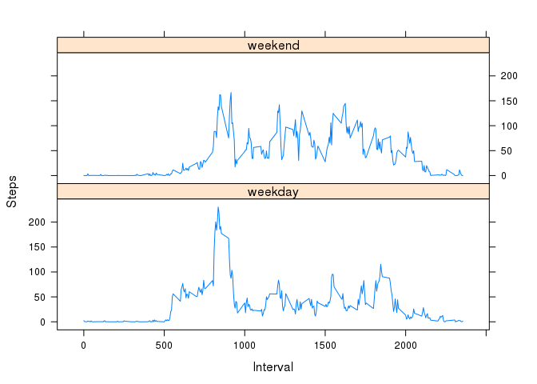

# Reproducible Research: Peer Assessment 1


## Loading and preprocessing the data

```r
df<-read.csv("activity.csv")
df[,"steps"]<-as.numeric(df$steps)
df[,"date"]<-as.Date(df$date)
time<-strptime(paste(df$date, formatC(df$interval, flag="0", width=4)), "%Y-%m-%d %H%M")
```


## What is mean total number of steps taken per day?

```r
library(data.table)
df.dt<-data.table(df)
df.dt[,sum:=sum(steps, na.rm=TRUE), by=date]
```

```
##        steps       date interval sum
##     1:    NA 2012-10-01        0   0
##     2:    NA 2012-10-01        5   0
##     3:    NA 2012-10-01       10   0
##     4:    NA 2012-10-01       15   0
##     5:    NA 2012-10-01       20   0
##    ---                              
## 17564:    NA 2012-11-30     2335   0
## 17565:    NA 2012-11-30     2340   0
## 17566:    NA 2012-11-30     2345   0
## 17567:    NA 2012-11-30     2350   0
## 17568:    NA 2012-11-30     2355   0
```

```r
mean(df.dt$sum)
```

```
## [1] 9354.23
```

```r
median(df.dt$sum)
```

```
## [1] 10395
```

```r
# charting
ds<-df.dt[,sum(steps, na.rm=TRUE), by=date]
plot(ds$date, ds$V1, type="h", xlab="Date", ylab="Steps")
m=mean(ds$V1)
md=median(ds$V1)
abline(h=m, col="green")
abline(h=md, col="blue")
legend("topleft", legend=c("mean", "median"), col=c("green", "blue"), lty=1)
```

 

```r
#text(ds$date[10], y=m, round(m, digits=0))
```


## What is the average daily activity pattern?

```r
dm<-df.dt[,mean(steps, na.rm=TRUE), by=interval]
setkey(dm, interval)
plot(type="l", dm, ylab="Steps", xlab="Interval")
maxSteps<-max(dm$V1)
maxInterval<-dm$interval[dm$V1==maxSteps]
maxInterval
```

```
## [1] 835
```

```r
points(y=maxSteps, x=maxInterval, col="red")
text(y=maxSteps, x=maxInterval, maxInterval, pos=4)
```

 


## Imputing missing values

```r
nas<-is.na(df$steps)
sum(nas)
```

```
## [1] 2304
```

```r
# use mean for the interval
stepsImputed<-df$steps
stepsImputed[is.na(stepsImputed)]<-0
stepsImputed<-stepsImputed+dm[interval==df$interval]$V1*nas
# create new dataset
df2=df
df2$steps<-stepsImputed
library(data.table)
df.dt2<-data.table(df2)
df.dt2[,sum:=sum(steps, na.rm=TRUE), by=date]
```

```
##            steps       date interval      sum
##     1: 1.7169811 2012-10-01        0 10766.19
##     2: 0.3396226 2012-10-01        5 10766.19
##     3: 0.1320755 2012-10-01       10 10766.19
##     4: 0.1509434 2012-10-01       15 10766.19
##     5: 0.0754717 2012-10-01       20 10766.19
##    ---                                       
## 17564: 4.6981132 2012-11-30     2335 10766.19
## 17565: 3.3018868 2012-11-30     2340 10766.19
## 17566: 0.6415094 2012-11-30     2345 10766.19
## 17567: 0.2264151 2012-11-30     2350 10766.19
## 17568: 1.0754717 2012-11-30     2355 10766.19
```

```r
# charting
ds2<-df.dt2[,sum(steps), by=date]
plot(ds2$date, ds2$V1, type="h", xlab="Date", ylab="Steps")
m2=mean(ds2$V1)
md2=median(ds2$V1)
abline(h=m, col="green")
abline(h=m2, col="cyan")
legend("topleft", legend=c("mean", "previous mean"), col=c("cyan", "green"), lty=1)
```

 

```r
# for each interval, the mean value does not change after imputing, when mean value for that interval is used
sum(dm$steps)
```

```
## [1] 0
```

```r
mean(df.dt2$sum)
```

```
## [1] 10766.19
```

```r
median(df.dt2$sum)
```

```
## [1] 10766.19
```


## Are there differences in activity patterns between weekdays and weekends?

```r
wf<-as.factor(ifelse(weekdays(ds$date) %in% c("Saturday", "Sunday"), "weekend", "weekday"))
df.dt[,wf:=as.factor(ifelse(weekdays(df.dt$date) %in% c("Saturday", "Sunday"), "weekend", "weekday"))]
```

```
##        steps       date interval sum      wf
##     1:    NA 2012-10-01        0   0 weekday
##     2:    NA 2012-10-01        5   0 weekday
##     3:    NA 2012-10-01       10   0 weekday
##     4:    NA 2012-10-01       15   0 weekday
##     5:    NA 2012-10-01       20   0 weekday
##    ---                                      
## 17564:    NA 2012-11-30     2335   0 weekday
## 17565:    NA 2012-11-30     2340   0 weekday
## 17566:    NA 2012-11-30     2345   0 weekday
## 17567:    NA 2012-11-30     2350   0 weekday
## 17568:    NA 2012-11-30     2355   0 weekday
```

```r
library(lattice)
xyplot(type="l", data=df.dt, steps ~ interval | wf, layout=c(1,2), ylab="Steps", xlab="Interval")
```

 

